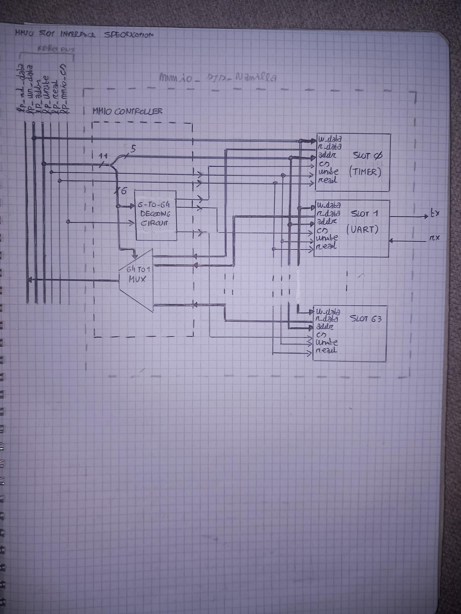

# MMIO Subsystem Architecture

## Overview

The MMIO (Memory-Mapped I/O) subsystem provides the communication interface between the MicroBlaze CPU and the FPGA peripherals.

The subsystem is designed around a slot-based architecture and allows scalable integration of custom peripherals.

The MMIO subsystem interfaces with the MicroBlaze processor through the FSL bus interface, using a custom lightweight protocol derived from the original proprietary bus structure.

---

## MMIO Controller

The MMIO controller is responsible for handling CPU memory-mapped transactions and routing them to the appropriate peripheral slot.

Main responsibilities:

- address decoding
- slot selection
- read data multiplexing
- write transaction routing
- peripheral interface management

RTL module:

- `chu_mmio_controller.vhd`

---

## Slot Architecture

The MMIO subsystem is organized using peripheral slots.

Each slot represents an independent memory-mapped peripheral interface.

System capabilities:

- up to 64 peripheral slots
- up to 32 registers per slot
- 32-bit register width

This architecture allows modular peripheral expansion without modifying the subsystem structure.

---

## Bus Interface

The MMIO subsystem uses a simplified internal bus derived from the original FSL communication structure.

Main interface signals include:

- address bus
- read strobe
- write strobe
- write data bus
- read data bus

The controller routes transactions to the selected slot according to the decoded address.

---

## Internal structure of MMIO subsystem

## Current Implemented Slots

| Slot | Peripheral |
|---|---|
| slot_0_sys_timer | System timer |
| slot_1_uart | UART peripheral |
| slot_2_gpo | GPIO output peripheral |
| slot_3_gpi | GPIO input peripheral |
| slot_5_pwm | PWM peripheral |

---

## Notes

The MMIO subsystem is intended to support future subsystem expansion, including additional peripherals and integration with the video subsystem architecture.
