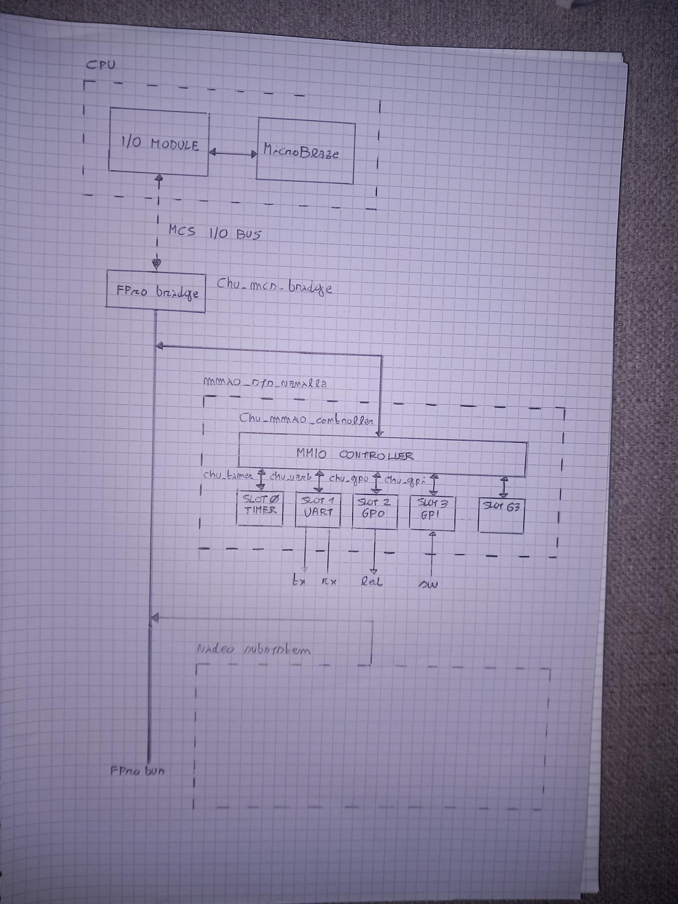

# SoC Overview

The system is based on a MicroBlaze MCS soft-core processor subsystem (comprising a MicroBlaze CPU and an I/O module) integrated into a custom FPGA-based SoC architecture.

The processor communicates with internal hardware modules through a vendor proprietary IP bus (MCS I/O Bus) .

A bridge module converts the processor-side bus transactions into a simplified internal MMIO-oriented bus used by the peripheral subsystem.

The SoC is divided into two main subsystems:

- MMIO subsystem
- VideoCore subsystem

## MMIO Subsystem

The MMIO subsystem manages memory-mapped peripherals such as:

- UART
- System timer
- GPIO output
- GPIO input

An MMIO controller decodes addresses and routes read/write transactions to the selected peripheral slot.

The architecture supports up to 64 peripheral slots, each exposing up to 32 memory-mapped registers of 32 bits.

## VideoCore Subsystem

The VideoCore subsystem will be dedicated to video generation and display-related processing modules.

## Top-Level Architecture 

