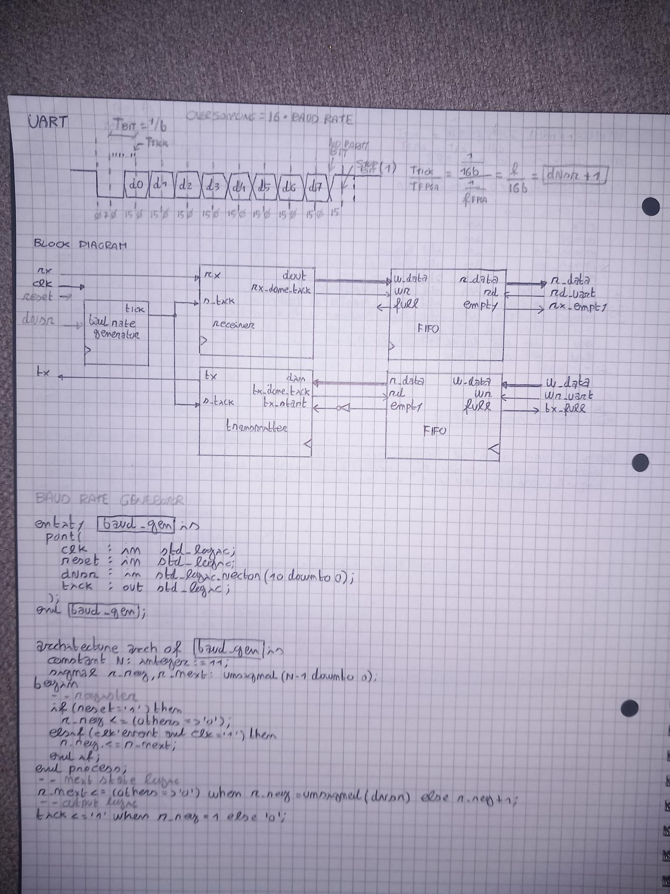

# Slot 1 - UART

Memory-mapped UART peripheral with TX/RX logic and FIFO buffering.

## Files
- `uart_core.vhd` - UART top-level peripheral
- `uart_tx.vhd` - UART transmitter
- `uart_rx.vhd` - UART receiver
- `baud_gen.vhd` - baud-rate tick generator
- `fifo.vhd` - FIFO buffer

## Function
Provides serial communication between the FPGA SoC and a host PC through the Basys3 USB-UART interface.

